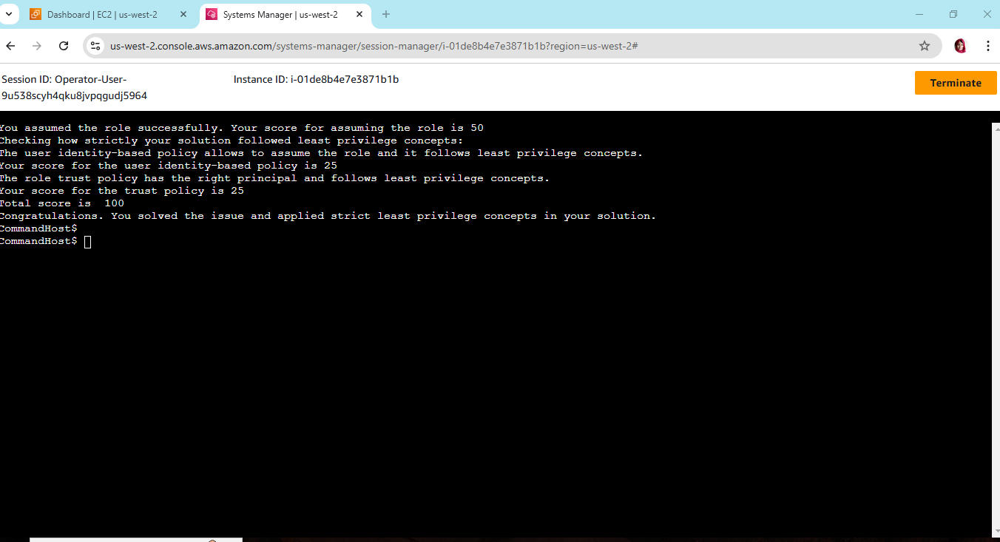

# **Troubleshooting IAM Role Assumption - SkillBuilder Lab**

## **Objective**
The objective of this lab was to troubleshoot an issue where an IAM user wasn't able to assume a specific role. The problem was resolved by fixing the IAM user's permissions to assume the desired role and ensuring the proper configuration of the role's trusted relationship.

## **Steps to Fix the Issue**

### **1. Identifying the Problem**
The IAM user was unable to assume the IAM role, which was causing a disruption in the workflow. Upon investigation, two main issues were identified:

- The IAM role lacked the **trusted relationship** to allow the IAM user to assume the role.
- The IAM user did not have the necessary **permissions** to assume the role.

### **2. Fixing the Trusted Relationship**
The **trusted relationship** is defined in the role’s **assume role policy** (also known as the trust policy). This policy specifies who can assume the role, typically by defining a **Principal** entity.

#### **Solution**:
- Navigate to the IAM role in the AWS Management Console.
- In the **Trust relationships** tab, update the trust policy to include the **IAM user**.

**Update Trust Policy (JSON)**:

Updating the principal of trust relationships:

This allows the IAM user to assume the IAM role.

### **3. Granting Permissions to the IAM User**
The IAM user must have explicit permissions to assume the role. If the role’s trust policy was corrected, but the IAM user still couldn’t assume it, the user’s IAM policy might need to be adjusted.

#### **Solution**:
- Ensure that the IAM user has the `sts:AssumeRole` permission in their IAM policy.
- Update or create a policy that grants the necessary permission.

**Selecting desired IAM User Policy (JSON)**:

Check which policy allows our desired actions:

**Attaching desired IAM User Policy (JSON)**:

Attch the policy to the IAM user:

### **4. Testing and Verification**
After making the changes to the trust policy and user permissions, the IAM user was able to assume the role and establish a session in an EC2 instance.

Successfully connected:

### **5. Conclusion**
By fixing the trust relationship in the IAM role and ensuring the IAM user had the appropriate permissions, the issue was resolved, and the IAM user was able to assume the role successfully.

---

